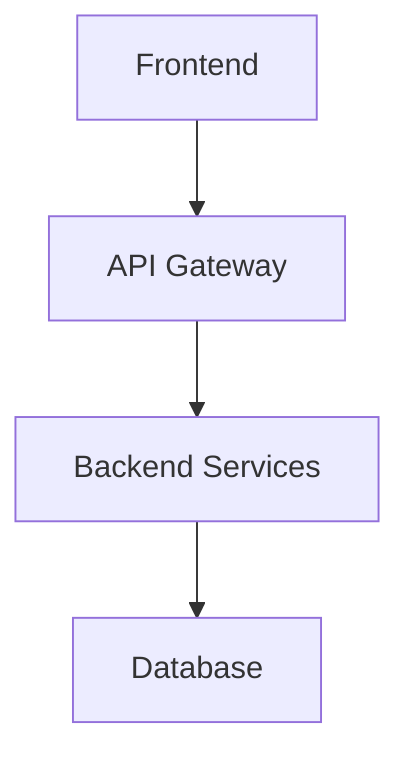

# OpenSpec Generator - Spec-Driven Development with AI

## Overview

OpenSpec Generator adalah fitur di VELA Radar yang mengimplementasikan spec-driven development workflow. Fitur ini membantu align humans dan AI coding assistants dengan membuat specifications sebelum code ditulis. Terintegrasi dengan Web Content Analyzer untuk seamless workflow dari content extraction ke technical specification.

**Philosophy**: "Agree on what to build before any code is written"

## Fitur Utama

### 1. Three-Phase Workflow

#### Phase 1: Requirements
- **User Stories**: Generate user stories dari content
- **Acceptance Criteria**: Clear success metrics
- **EARS Format**: Easy Approach to Requirements Syntax
- **Stakeholder Alignment**: Ensure everyone agrees

#### Phase 2: Design
- **Technical Architecture**: System design dan components
- **Data Models**: Database schema dan structures
- **API Specifications**: Endpoints dan contracts
- **Component Structure**: Frontend/backend organization

#### Phase 3: Tasks
- **Implementation Checklist**: Step-by-step tasks
- **File References**: Specific files to create/modify
- **Requirement Mapping**: Link tasks to requirements
- **Progress Tracking**: Checkbox untuk completion

### 2. AI-Powered Generation
- **Content Analysis**: Understand input content
- **Context-Aware**: Generate relevant specs
- **Multi-Model Support**: Amazon Nova, Kat Coder Pro, Nemotron
- **Iterative Refinement**: Regenerate dengan different models

### 3. Export & Documentation
- **PDF Export**: Professional documentation
- **Markdown Format**: Easy to read dan edit
- **Version Control**: Track changes over time
- **Shareable**: Send to team members

### 4. Integration Points
- **Web Content Analyzer**: Auto-populate dari URL scraping
- **Direct Input**: Paste content manually
- **URL Scraping**: Built-in Jina Reader
- **File Upload**: (Future) Upload documents

## Setup

### 1. Dependencies
Already included in main setup:
```bash
yarn install
```

### 2. API Configuration
File: `.env`
```bash
OPENROUTER_API_KEY=sk-or-v1-your_key_here
JINA_API_KEY=jina_your_key_here
```

### 3. Backend Service
Location: `plugins/vela-backend/src/service/modules/radar/SpecGenerator.ts`

Auto-configured via `app-config.yaml`:
```yaml
vela:
  openrouter:
    apiKey: ${OPENROUTER_API_KEY}
  jina:
    apiKey: ${JINA_API_KEY}
```

## Cara Penggunaan

### Method 1: Via Web Content Analyzer (Recommended)

#### Step 1: Extract Content
1. Go to **Web Content Analyzer** tab
2. Input URL (e.g., Wikipedia article, product page)
3. Click **Extract & Analyze**
4. Review extracted content

#### Step 2: Generate Spec
1. Click **Generate Technical Spec** button
2. Content otomatis ter-load ke OpenSpec Generator
3. Select AI model
4. Click **Generate Requirements**

#### Step 3: Review & Refine
1. Review generated requirements
2. Edit jika perlu
3. Click **Generate Design**
4. Review technical design
5. Click **Generate Tasks**

#### Step 4: Export
1. Click **Export to PDF**
2. Download complete specification
3. Share dengan team

### Method 2: Direct URL Input

#### Step 1: Access OpenSpec
1. Navigate to `/vela/radar/openspec` (via button atau direct URL)
2. OpenSpec tidak visible di tabs (by design)

#### Step 2: Input URL
1. Enter URL di input field
2. Click **Extract Content**
3. Wait untuk Jina Reader

#### Step 3: Generate Phases
1. **Requirements**: Click generate
2. **Design**: Click generate after requirements
3. **Tasks**: Click generate after design

### Method 3: Manual Content Input

#### Step 1: Paste Content
1. Access OpenSpec Generator
2. Paste content directly ke text area
3. Skip URL extraction

#### Step 2: Generate Specs
Follow same workflow as Method 2

## Architecture

```
OpenSpec/
├── OpenSpecPage.tsx              # Main page component
├── components/
│   ├── UrlInput.tsx              # URL input dengan Jina Reader
│   ├── ContentDisplay.tsx        # Show extracted content
│   ├── SpecGeneratorControls.tsx # Generate buttons
│   ├── DocumentViewer.tsx        # Display generated specs
│   └── ExportButton.tsx          # PDF export
├── services/
│   ├── jinaService.ts            # Jina Reader API
│   └── specGeneratorService.ts   # Backend API calls
├── utils/
│   ├── cache.ts                  # Caching logic
│   ├── pdfExporter.ts            # PDF generation
│   └── validators.ts             # Input validation
└── types.ts                      # TypeScript interfaces
```

## Backend Service

### SpecGenerator.ts
Location: `plugins/vela-backend/src/service/modules/radar/SpecGenerator.ts`

**Core Methods:**
```typescript
async generateRequirements(content: string, model: string): Promise<string>
async generateDesign(requirements: string, model: string): Promise<string>
async generateTasks(design: string, model: string): Promise<string>
```

**Features:**
- OpenRouter AI integration
- Context-aware prompts
- Markdown formatting
- Error handling
- Retry logic

## AI Prompts

### Requirements Generation
```
You are a product requirements expert. Analyze the following content and generate:

1. User Stories (EARS format)
   - WHEN [trigger]
   - IF [condition]
   - THEN [system response]

2. Acceptance Criteria
   - Clear success metrics
   - Testable conditions
   - Edge cases

3. Functional Requirements
   - Core features
   - User interactions
   - System behaviors

4. Non-Functional Requirements
   - Performance
   - Security
   - Scalability

Content: [input content]

Return in Markdown format with clear sections.
```

### Design Generation
```
You are a software architect. Based on the requirements, create:

1. System Architecture
   - High-level components
   - Data flow
   - Integration points

2. Technical Stack
   - Frontend technologies
   - Backend services
   - Database choices

3. Data Models
   - Entity schemas
   - Relationships
   - Constraints

4. API Specifications
   - Endpoints
   - Request/Response formats
   - Authentication

5. Component Structure
   - File organization
   - Module dependencies
   - Naming conventions

Requirements: [generated requirements]

Return in Markdown format with diagrams (Mermaid syntax).
```

### Tasks Generation
```
You are a technical lead. Break down the design into implementation tasks:

1. Setup & Configuration
   - [ ] Task description
   - Files: [specific files]
   - Requirements: [linked requirements]

2. Backend Development
   - [ ] Database schema
   - [ ] API endpoints
   - [ ] Business logic

3. Frontend Development
   - [ ] Components
   - [ ] State management
   - [ ] UI/UX

4. Integration
   - [ ] API integration
   - [ ] Testing
   - [ ] Deployment

Design: [generated design]

Return as Markdown checklist with file references.
```

## Spec Format

### Requirements Document
```markdown
# Requirements Specification

## 1. Overview
Brief description of the project

## 2. User Stories
### US-001: [Title]
**As a** [user type]
**I want** [goal]
**So that** [benefit]

**Acceptance Criteria:**
- [ ] Criterion 1
- [ ] Criterion 2

## 3. Functional Requirements
### FR-001: [Feature]
Description and details

## 4. Non-Functional Requirements
### NFR-001: [Quality Attribute]
Metrics and constraints
```

### Design Document
```markdown
# Design Specification

## 1. System Architecture


## 2. Technical Stack
- **Frontend**: React, TypeScript
- **Backend**: Node.js, Express
- **Database**: PostgreSQL

## 3. Data Models
### Entity: User
```typescript
interface User {
  id: string;
  name: string;
  email: string;
}
```

## 4. API Endpoints
### POST /api/users
Create new user
```

### Tasks Document
```markdown
# Implementation Tasks

## Phase 1: Setup
- [ ] **1.1 Initialize Project**
  - Files: `package.json`, `tsconfig.json`
  - Requirements: FR-001

- [ ] **1.2 Configure Database**
  - Files: `src/db/schema.sql`
  - Requirements: FR-002

## Phase 2: Backend
- [ ] **2.1 Create User Model**
  - Files: `src/models/User.ts`
  - Requirements: FR-003

## Phase 3: Frontend
- [ ] **3.1 Create User Component**
  - Files: `src/components/User.tsx`
  - Requirements: FR-004
```

## Export Features

### PDF Export
**Features:**
- Professional formatting
- Table of contents
- Syntax highlighting
- Page numbers
- Headers/footers

**Implementation:**
```typescript
// utils/pdfExporter.ts
export async function exportToPDF(
  requirements: string,
  design: string,
  tasks: string
): Promise<Blob>
```

**Usage:**
```typescript
const pdfBlob = await exportToPDF(req, design, tasks);
const url = URL.createObjectURL(pdfBlob);
// Download or display
```

### Markdown Export
**Features:**
- Raw markdown files
- Easy to edit
- Version control friendly
- Compatible dengan Git

## Integration dengan Web Content Analyzer

### Data Flow
```
Web Content Analyzer
  ↓ (Extract & Analyze)
Structured Data + Summary
  ↓ (Generate Technical Spec button)
OpenSpec Generator
  ↓ (Auto-populate content)
Requirements Generation
  ↓
Design Generation
  ↓
Tasks Generation
  ↓
PDF Export
```

### State Management
```typescript
// Navigation dengan state
navigate('/vela/radar/openspec', {
  state: {
    preloadedContent: content,
    sourceUrl: url
  }
});

// Receive di OpenSpec
const location = useLocation();
const { preloadedContent, sourceUrl } = location.state || {};
```

## Best Practices

### 1. Content Preparation
- **Clear Input**: Provide detailed content
- **Structured Data**: Better results dengan organized content
- **Context**: Include background information
- **Examples**: Add examples jika applicable

### 2. Model Selection
- **Nova Lite**: Quick specs, simple projects
- **Kat Coder Pro**: Complex projects, detailed specs
- **Nemotron**: Balance untuk most cases

### 3. Iterative Refinement
- **Review Each Phase**: Don't auto-generate all
- **Edit as Needed**: Specs are starting point
- **Regenerate**: Try different models
- **Combine**: Mix manual edits dengan AI

### 4. Team Collaboration
- **Share Early**: Get feedback on requirements
- **Version Control**: Track changes
- **Document Decisions**: Add notes
- **Update Regularly**: Keep specs current

## Troubleshooting

### Error: "Failed to generate requirements"
**Penyebab**:
- Empty content
- API error
- Invalid model

**Solusi**:
1. Check content is not empty
2. Verify API keys
3. Try different model
4. Check backend logs

### Generated Spec Tidak Relevan
**Penyebab**:
- Content tidak clear
- Wrong model selection
- Insufficient context

**Solusi**:
1. Provide more detailed content
2. Try Kat Coder Pro untuk better accuracy
3. Add more context
4. Edit manually

### PDF Export Gagal
**Penyebab**:
- Large document
- Browser memory
- Invalid markdown

**Solusi**:
1. Reduce document size
2. Close other tabs
3. Check markdown syntax
4. Try again

### Slow Generation
**Penyebab**:
- Large content
- Complex analysis
- API latency

**Solusi**:
1. Use Nova Lite untuk speed
2. Reduce content size
3. Check internet connection
4. Wait patiently (can take 10-30s)

## Advanced Usage

### Custom Prompts
Edit backend prompts untuk specific needs:
```typescript
// SpecGenerator.ts
const customPrompt = `
Your custom instructions here...
Focus on: ${specificRequirements}
`;
```

### Batch Generation
Generate specs untuk multiple URLs:
```typescript
const urls = ['url1', 'url2', 'url3'];
for (const url of urls) {
  const content = await extractContent(url);
  const spec = await generateSpec(content);
  await saveSpec(spec);
}
```

### Template System
Create reusable templates:
```markdown
# [Project Name] Specification

## Context
[Auto-filled from content]

## Requirements
[AI-generated]

## Design
[AI-generated]

## Tasks
[AI-generated]
```

## Performance Optimization

### Caching
```typescript
// Cache generated specs
const cacheKey = `spec_${contentHash}`;
const cached = cache.get(cacheKey);
if (cached) return cached;

const spec = await generateSpec(content);
cache.set(cacheKey, spec, 3600); // 1 hour TTL
```

### Parallel Generation
```typescript
// Generate phases in parallel (if independent)
const [requirements, design] = await Promise.all([
  generateRequirements(content),
  generateDesign(content)
]);
```

### Streaming Response
```typescript
// Stream large specs (future enhancement)
const stream = await generateSpecStream(content);
for await (const chunk of stream) {
  updateUI(chunk);
}
```

## Security Considerations

### Input Validation
- Sanitize URLs
- Validate content length
- Check for malicious input
- Rate limiting

### API Key Protection
- Never expose keys di frontend
- Use environment variables
- Rotate regularly
- Monitor usage

### Data Privacy
- No permanent storage
- In-memory processing only
- HTTPS for all requests
- Secure API calls

## Future Enhancements

- [ ] Template library
- [ ] Custom prompt editor
- [ ] Collaborative editing
- [ ] Version history
- [ ] Diff viewer
- [ ] Integration dengan Jira/GitHub
- [ ] Automated testing generation
- [ ] Code scaffolding
- [ ] CI/CD pipeline generation
- [ ] Documentation generation

## Example Workflows

### Workflow 1: New Feature Development
1. Product manager provides feature description
2. Paste ke OpenSpec Generator
3. Generate requirements
4. Review dengan team
5. Generate design
6. Review dengan architects
7. Generate tasks
8. Assign to developers
9. Export PDF untuk documentation

### Workflow 2: Competitive Analysis
1. Scrape competitor product page (Web Content Analyzer)
2. Generate technical spec
3. Compare dengan current product
4. Identify gaps
5. Create improvement tasks

### Workflow 3: Documentation Creation
1. Extract content dari existing code
2. Generate requirements (reverse engineering)
3. Generate design docs
4. Update documentation

## Support & Resources

### Documentation
- [CSV-Analyzer.md](./CSV-Analyzer.md)
- [Web-Content-Analyzer.md](./Web-Content-Analyzer.md)
- [Jina.md](./Jina.md)

### API References
- OpenRouter: https://openrouter.ai/docs
- Jina AI: https://jina.ai/docs

### Community
- GitHub Issues
- Team Slack channel
- Weekly sync meetings

## Contributing

### Adding New Features
1. Update requirements
2. Modify prompts
3. Test thoroughly
4. Update documentation
5. Submit PR

### Improving Prompts
1. Test dengan various inputs
2. Measure quality
3. Iterate
4. Document changes

### Bug Reports
Include:
- Input content
- Selected model
- Error messages
- Console logs
- Expected vs actual output
